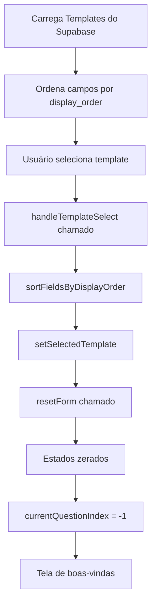

# Documentação Técnica - Fluxo de Dados do Sistema

> **Objetivo:** Documentar o fluxo completo de dados desde o preenchimento do questionário até a geração final do contrato, incluindo todas as funcionalidades implementadas (cláusulas condicionais, campos repetíveis, ordenação, etc.)

---

## 1. Visão Geral do Sistema

### 1.1. Arquitetura

O sistema utiliza **React Context API** para gerenciamento de estado global, com fluxo unidirecional de dados:

```
Template (DB) → Context → Questionnaire → Preview → Final Document
```

### 1.2. Estados Principais

| Estado | Tipo | Descrição |
|--------|------|-----------|
| `selectedTemplate` | `ContractTemplate \| null` | Template ativo selecionado pelo usuário |
| `formValues` | `Record<string, string>` | **Fonte única de verdade** para campos não-repetíveis |
| `repeatableFieldsData` | `RepeatableFieldResponse[]` | Dados de campos repetíveis por parte |
| `partiesData` | `PartyData[]` | Dados das partes principais |
| `otherPartiesData` | `PartyData[]` | Dados de outras partes envolvidas |
| `locationData` | `LocationData \| null` | Local e data de assinatura |
| `currentQuestionIndex` | `number` | Índice da questão atual no questionário |

### 1.3. Componentes Principais

- **`ContractContext`**: Gerencia todo o estado e lógica de negócio
- **`QuestionnaireForm`**: Renderiza questões baseadas no índice atual
- **`ContractPreview`**: Exibe preview em tempo real do contrato
- **`TemplateEditor`**: Editor admin para criar/editar templates

---

## 2. Tipos de Dados e Estruturas

### 2.1. ContractTemplate

```typescript
interface ContractTemplate {
  id: string;
  name: string;
  description: string;
  template: string;                    // Texto do contrato com placeholders
  fields: ContractField[];             // Campos ordenados
  version?: TemplateVersion;
  usePartySystem?: boolean;            // Sistema de múltiplas partes
  created_at?: string;
  updated_at?: string;
  is_default?: boolean;
}
```

### 2.2. ContractField

```typescript
interface ContractField {
  id: string;                          // ID do campo (usado como placeholder)
  label: string;                       // Texto da pergunta
  type: 'text' | 'textarea' | 'select' | 'number' | 'email' | 'tel' | 'date' | 'info';
  placeholder?: string;
  required?: boolean;
  options?: string[];                  // Para campos select
  
  // Ajuda contextual
  helpText?: string;
  helpVideo?: string;
  howToFill?: string;
  whyImportant?: string;
  videoLink?: string;
  aiAssistantLink?: string;
  
  // Funcionalidades avançadas
  conditionalLogic?: ConditionalLogic; // Controla VISIBILIDADE do campo
  repeatPerParty?: boolean;            // Campo repetível por cada parte
  answerTemplates?: AnswerTemplate[];  // Modelos de resposta pré-formatados
  answerTemplateMode?: 'replace' | 'append';       // NOVO v2.3
  includeValueInContract?: boolean;                 // NOVO v2.3 (apenas select)
  infoContent?: string;                             // NOVO v2.3 (apenas type='info')
  display_order?: number;              // Ordem de exibição (0, 1, 2...)
}
```

### 2.3. ConditionalLogic

```typescript
interface ConditionalLogic {
  conditions: FieldCondition[];        // Lista de condições
  action: 'show' | 'hide';             // Ação quando condições satisfeitas
}

interface FieldCondition {
  fieldId: string;                     // Campo que controla a visibilidade
  operator: 'equals' | 'notEquals' | 'contains' | 'greaterThan' | 'lessThan';
  value: string | number;              // Valor que dispara a condição
  logicOperator?: 'AND' | 'OR';        // Operador lógico com próxima condição
}
```

**Exemplo:**
```json
{
  "id": "detalhes_adicionais",
  "conditionalLogic": {
    "conditions": [
      {
        "fieldId": "tipo_contrato",
        "operator": "equals",
        "value": "Prestação de Serviços",
        "logicOperator": "AND"
      },
      {
        "fieldId": "valor_contrato",
        "operator": "greaterThan",
        "value": "10000"
      }
    ],
    "action": "show"
  }
}
```

### 2.4. RepeatableFieldResponse

```typescript
interface RepeatableFieldResponse {
  fieldId: string;                     // ID do campo repetível
  responses: {
    partyId: string;                   // ID da parte
    partyName: string;                 // Nome da parte (para exibição)
    value: string;                     // Valor respondido
  }[];
}
```

### 2.5. PartyData

```typescript
interface PartyData {
  id: string;
  fullName: string;
  nationality: string;
  maritalStatus: string;
  profession?: string;        // ← NOVO v2.3 (opcional)
  cpf: string;
  email?: string;             // ← NOVO v2.3 (opcional)
  address: string;
  city: string;
  state: string;
  partyType: string;
  category: 'main' | 'other';
}
```

### 2.6. Novos Campos e Funcionalidades (v2.3.0)

#### 2.6.1. `includeValueInContract` (Campos Select)

**Propósito:** Permitir que campos `select` sejam usados apenas para controle de lógica, sem incluir o valor no contrato final.

**Tipo:** `boolean` (padrão: `true`)

**Quando é processado:**
- Durante `generatePreviewText()`: Placeholder `{{fieldId}}` é substituído por string vazia
- Durante `generateFinalDocument()`: Linha inteira contendo `{{fieldId}}` é removida

**Exemplo:**

```typescript
// Campo no template
{
  id: "incluir_foro",
  type: "select",
  options: ["Sim", "Não"],
  includeValueInContract: false
}

// FormValues
{
  "incluir_foro": "Sim"  // ← Valor é SALVO mas NÃO aparece no contrato
}

// Template text
"Valor: {{incluir_foro}}\n\n{{#if incluir_foro equals \"Sim\"}}...{{/if}}"

// Resultado
"Valor: \n\n..." // ← Placeholder removido, mas {{#if}} funciona
```

#### 2.6.2. `answerTemplateMode` (Answer Templates)

**Propósito:** Controlar como sugestões de `answerTemplates` são inseridas em campos `textarea`.

**Tipo:** `'replace' | 'append'` (padrão: `'replace'`)

**Comportamento:**
- `'replace'`: Substitui todo o conteúdo do textarea (comportamento original)
- `'append'`: Concatena com o conteúdo existente usando `\n` como separador

**Processamento no componente `AnswerTemplatesSelector.tsx`:**

```typescript
const handleTemplateClick = (templateValue: string) => {
  if (mode === 'append' && currentValue.trim()) {
    const newValue = currentValue.trim() + '\n' + templateValue;
    onSelectTemplate(newValue);
  } else {
    onSelectTemplate(templateValue);
  }
};
```

**Log gerado:**
- `[ANSWER-TEMPLATE] Modo REPLACE: { value: "..." }`
- `[ANSWER-TEMPLATE] Modo APPEND: { previous: "...", added: "..." }`

#### 2.6.3. `type: 'info'` (Cards Informativos)

**Propósito:** Exibir blocos puramente informativos no questionário, sem coletar dados.

**Campos específicos:**
- `infoContent` (obrigatório): Conteúdo do texto informativo
- `title` (opcional): Título do card

**Campos ignorados:** `placeholder`, `required`, `repeatPerParty`, `answerTemplates`, `options`

**Campos que funcionam:** `conditionalLogic`, `display_order`

**Renderização:** Componente `QuestionnaireInfoCard.tsx`

**Características:**
- Não gera placeholder no contrato
- Não conta como campo obrigatório
- Suporta formatação: `**negrito**` e quebras de linha `\n`
- Navegação simples (Anterior/Próxima sem validação)

**Exemplo:**

```typescript
{
  id: "info_aviso",
  title: "Atenção",
  type: "info",
  infoContent: "**Importante:** Leia com atenção.\n\nPróxima seção é crítica.",
  display_order: 50
}
```

#### 2.6.4. Campos Opcionais em `PartyData`

**Novos campos:**
- `profession?: string` - Profissão ou cargo da parte
- `email?: string` - E-mail de contato

**Comportamento:**
- Aparecem na qualificação das partes **apenas se preenchidos**
- Não bloqueiam finalização (opcionais)
- Salvos no estado `partiesData` e `otherPartiesData`

**Formato na qualificação:**

```typescript
let qualification = `nacionalidade ${nationality}, ${maritalStatus}`;
if (profession) {
  qualification += `, ${profession}`;
}
qualification += `, inscrito no CPF sob o nº ${cpf}, ...`;
if (email) {
  qualification += `, e-mail ${email}`;
}
```

**Exemplo:**
```
João Silva, nacionalidade brasileira, solteiro, engenheiro civil, inscrito no CPF sob o nº 123.456.789-00, residente e domiciliado à Rua X, São Paulo, SP, e-mail joao@exemplo.com
```

#### 2.6.5. Formato de Data Uniformizado

**Padrão:** dd/mm/aaaa em toda a interface

**Armazenamento:**
- `locationData.date`: Formato ISO (`YYYY-MM-DD`)
- Função utilitária: `formatDateToBrazilian()` em `src/utils/dateUtils.ts`

**Conversão:**
```typescript
export const formatDateToBrazilian = (dateString: string): string => {
  if (!dateString) return '';
  const [year, month, day] = dateString.split('-');
  return `${day}/${month}/${year}`;
};
```

**Uso:**
- Preview: `formatDateToBrazilian(locationData.date)`
- Final document: `formatDateToBrazilian(locationData.date)`
- Summary: `new Date(locationData.date).toLocaleDateString('pt-BR')`

---

## 3. Ciclo de Vida do Preenchimento

### 3.1. Inicialização



**Código relevante (`ContractContext.tsx`):**

```typescript
const sortFieldsByDisplayOrder = (fields: ContractField[]): ContractField[] => {
  return [...fields].sort((a, b) => {
    const orderA = a.display_order ?? 999999;
    const orderB = b.display_order ?? 999999;
    return orderA - orderB;
  });
};

const handleTemplateSelect = (template: ContractTemplate) => {
  const sortedFields = sortFieldsByDisplayOrder(template.fields || []);
  setSelectedTemplate({
    ...template,
    fields: sortedFields
  });
  resetForm();
};
```

### 3.2. Fluxo do Questionário - Índices

O `currentQuestionIndex` determina qual tela é exibida:

| Índice | Tela Exibida |
|--------|--------------|
| `-1` | Tela de boas-vindas (`QuestionnaireWelcome`) |
| `-2` | Seleção do número de partes (`PartyNumberQuestion`) |
| `-1000 a -1000 + N` | Dados das N partes principais (`PartyDataCard`) |
| `-3` | Perguntar se há outras partes envolvidas (`OtherPartiesQuestion`) |
| `-4` | Número de outras partes (`OtherPartiesNumberQuestion`) |
| `-2000 a -2000 + M` | Dados das M outras partes (`PartyDataCard`) |
| `-5` | Local e data de assinatura (`LocationDateQuestion`) |
| `0 a 999` | Campos repetíveis por parte (`RepeatableFieldCard`) |
| `1000 a 9998` | Campos não-repetíveis visíveis (`QuestionnaireQuestion`) |
| `9999` | Resumo final (`QuestionnaireSummary`) |

### 3.3. Cálculo de Campos Visíveis

**Executado em tempo real usando `useMemo`:**

```typescript
// Em QuestionnaireForm.tsx
const visibleFields = useMemo(() => {
  if (!selectedTemplate?.fields) return [];
  return getNonRepeatableVisibleFields(
    selectedTemplate.fields,
    formValues
  );
}, [selectedTemplate?.fields, formValues]);

const repeatableFields = useMemo(() => {
  if (!selectedTemplate?.fields) return [];
  return getRepeatableVisibleFields(
    selectedTemplate.fields,
    formValues
  );
}, [selectedTemplate?.fields, formValues]);
```

**Funções de filtragem (`conditionalLogic.ts`):**

```typescript
export const getNonRepeatableVisibleFields = (
  fields: ContractField[],
  formValues: Record<string, string>
): ContractField[] => {
  return getVisibleFields(fields, formValues)
    .filter(field => !field.repeatPerParty);
};

export const getRepeatableVisibleFields = (
  fields: ContractField[],
  formValues: Record<string, string>
): ContractField[] => {
  return getVisibleFields(fields, formValues)
    .filter(field => field.repeatPerParty === true);
};
```

### 3.4. Navegação Dinâmica

A navegação **pula automaticamente** índices de campos ocultos:

```typescript
const handleNext = () => {
  // ... validações ...
  
  // Para campos não-repetíveis, pular campos ocultos
  if (currentQuestionIndex >= 1000 && currentQuestionIndex < 9998) {
    const currentFieldIndex = currentQuestionIndex - 1000;
    const nextFieldIndex = currentFieldIndex + 1;
    
    if (nextFieldIndex < visibleFields.length) {
      setCurrentQuestionIndex(1000 + nextFieldIndex);
    } else {
      setCurrentQuestionIndex(9999); // Resumo
    }
  }
};
```

---

## 4. Sistema de Visibilidade Condicional

### 4.1. Dois Sistemas Distintos

#### Sistema 1: `conditionalLogic` (Campos)
- **Local:** Propriedade do campo (`field.conditionalLogic`)
- **Controla:** Visibilidade de **campos** no questionário
- **Execução:** Tempo real (a cada mudança em `formValues`)
- **Função:** `evaluateConditionalLogic()`

#### Sistema 2: `{{#if}}...{{/if}}` (Texto)
- **Local:** Dentro do texto do template (`template.template`)
- **Controla:** Inclusão de **blocos de texto** no contrato
- **Execução:** Durante renderização (preview/final document)
- **Função:** `parseConditionalClauses()`

### 4.2. Lógica Condicional de Campos

**Avaliação de uma condição individual:**

```typescript
export const evaluateCondition = (
  condition: FieldCondition,
  formValues: Record<string, string>
): boolean => {
  const fieldValue = formValues[condition.fieldId];
  
  switch (condition.operator) {
    case 'equals':
      return fieldValue === String(condition.value);
    case 'notEquals':
      return fieldValue !== String(condition.value);
    case 'contains':
      return fieldValue?.includes(String(condition.value)) || false;
    case 'greaterThan':
      return Number(fieldValue) > Number(condition.value);
    case 'lessThan':
      return Number(fieldValue) < Number(condition.value);
    default:
      return false;
  }
};
```

**Avaliação de lógica condicional completa:**

```typescript
export const evaluateConditionalLogic = (
  logic: ConditionalLogic | undefined,
  formValues: Record<string, string>
): boolean => {
  if (!logic || logic.conditions.length === 0) {
    return true; // Sem condições = sempre visível
  }

  // Avaliar cada condição
  const results = logic.conditions.map(condition => 
    evaluateCondition(condition, formValues)
  );

  // Aplicar operadores lógicos sequencialmente
  let finalResult = results[0];
  
  for (let i = 1; i < logic.conditions.length; i++) {
    const operator = logic.conditions[i - 1].logicOperator || 'AND';
    
    if (operator === 'OR') {
      finalResult = finalResult || results[i];
    } else { // AND
      finalResult = finalResult && results[i];
    }
  }

  // Se action é "show", retorna true quando condições satisfeitas
  // Se action é "hide", retorna false quando condições satisfeitas
  return logic.action === 'show' ? finalResult : !finalResult;
};
```

**Exemplo de avaliação:**

```json
{
  "conditions": [
    { "fieldId": "A", "operator": "equals", "value": "Sim", "logicOperator": "OR" },
    { "fieldId": "B", "operator": "equals", "value": "Sim", "logicOperator": "AND" },
    { "fieldId": "C", "operator": "greaterThan", "value": "100" }
  ],
  "action": "show"
}
```

**Avaliação:**
```
results = [A_result, B_result, C_result]

Passo 1: finalResult = A_result
Passo 2: finalResult = finalResult OR B_result  (operador da condição 0)
Passo 3: finalResult = finalResult AND C_result (operador da condição 1)

Se action = "show": retorna finalResult
Se action = "hide": retorna !finalResult
```

### 4.3. Cláusulas Condicionais no Texto

**Sintaxe no template:**

```
{{#if campo_id operator "valor"}}
Texto que só aparece se a condição for verdadeira.
Pode conter múltiplas linhas.
{{/if}}
```

**Parser (`parseConditionalClauses()` em `ContractContext.tsx`):**

```typescript
const parseConditionalClauses = (text: string): string => {
  const conditionalRegex = /\{\{#if\s+(.+?)\}\}([\s\S]*?)\{\{\/if\}\}/gi;
  
  return text.replace(conditionalRegex, (match, condition, content) => {
    const shouldInclude = evaluateConditionalString(condition.trim(), formValues);
    return shouldInclude ? content : '';
  });
};
```

**Avaliação de condição string:**

```typescript
const evaluateConditionalString = (
  conditionStr: string,
  values: Record<string, string>
): boolean => {
  // Dividir por AND/OR
  const andParts = conditionStr.split(/\s+AND\s+/i);
  
  return andParts.every(andPart => {
    const orParts = andPart.split(/\s+OR\s+/i);
    
    return orParts.some(orPart => {
      return evaluateSingleCondition(orPart.trim(), values);
    });
  });
};
```

**Avaliação de condição única:**

```typescript
const evaluateSingleCondition = (
  condition: string,
  values: Record<string, string>
): boolean => {
  // Parse: fieldId operator "value"
  const match = condition.match(/(\w+)\s+(equals|notEquals|contains|greaterThan|lessThan)\s+"([^"]*)"/);
  
  if (!match) return false;
  
  const [, fieldId, operator, expectedValue] = match;
  const actualValue = values[fieldId] || '';
  
  switch (operator) {
    case 'equals':
      return actualValue === expectedValue;
    case 'notEquals':
      return actualValue !== expectedValue;
    case 'contains':
      return actualValue.includes(expectedValue);
    case 'greaterThan':
      return Number(actualValue) > Number(expectedValue);
    case 'lessThan':
      return Number(actualValue) < Number(expectedValue);
    default:
      return false;
  }
};
```

**Exemplo prático:**

**Template:**
```
CLÁUSULA 1ª - OBJETO
[objeto_contrato]

{{#if incluir_confidencialidade equals "Sim"}}
CLÁUSULA 2ª - CONFIDENCIALIDADE

As partes se comprometem a manter sigilo sobre [informacoes_confidenciais].
{{/if}}

{{#if prazo_anos greaterThan "5"}}
CLÁUSULA 3ª - VIGÊNCIA PROLONGADA

Considerando o prazo superior a 5 anos, as partes poderão renegociar as condições após [anos_renegociacao] anos.
{{/if}}
```

**FormValues:**
```json
{
  "objeto_contrato": "Prestação de serviços de consultoria",
  "incluir_confidencialidade": "Sim",
  "informacoes_confidenciais": "dados financeiros",
  "prazo_anos": "7",
  "anos_renegociacao": "3"
}
```

**Resultado após `parseConditionalClauses`:**
```
CLÁUSULA 1ª - OBJETO
Prestação de serviços de consultoria

CLÁUSULA 2ª - CONFIDENCIALIDADE

As partes se comprometem a manter sigilo sobre dados financeiros.

CLÁUSULA 3ª - VIGÊNCIA PROLONGADA

Considerando o prazo superior a 5 anos, as partes poderão renegociar as condições após 3 anos.
```

### 4.4. Tabela Comparativa Completa

| Aspecto | `conditionalLogic` | `{{#if}}...{{/if}}` |
|---------|-------------------|----------------------|
| **Controla** | Visibilidade de CAMPOS | Inclusão de TEXTO |
| **Local de definição** | Propriedade do campo JSON | Dentro do texto do template |
| **Sintaxe** | JSON estruturado | String template |
| **Execução** | Tempo real (a cada `formValues` change) | Na renderização (preview/final) |
| **Impacto no questionário** | Mostra/oculta perguntas | Nenhum |
| **Impacto no contrato** | Indiretamente (via placeholders) | Diretamente (mostra/oculta blocos) |
| **Uso recomendado** | Perguntas dependentes | Cláusulas opcionais |
| **Pode aninhar?** | Sim (campo A depende de B, B de C) | Não (não suportado) |
| **Exemplo típico** | "Mostrar 'detalhes' se tipo='Sim'" | "Incluir cláusula de foro se escolheu 'Sim'" |

---

## 5. Pipeline de Geração de Texto

### 5.1. Diferença Preview vs Final Document

| Característica | Preview (`generatePreviewText`) | Final (`generateFinalDocument`) |
|----------------|----------------------------------|----------------------------------|
| **Placeholders vazios** | Mantém `[campo]` visível (feedback) | Remove completamente |
| **Smart Replacement** | ❌ Não usa | ✅ Usa (remove linhas vazias) |
| **Objetivo** | Mostrar progresso em tempo real | Documento limpo e final |
| **Formatação** | Mínima | Completa (cleanup de espaços) |

### 5.2. Pipeline de Preview

```mermaid
graph TD
    A[Template Original] --> B[parseConditionalClauses]
    B --> C{{{#if}} avaliados}
    C --> D[Substituir campos repetíveis visíveis]
    D --> E[Substituir campos normais visíveis]
    E --> F[Remover placeholders de campos OCULTOS]
    F --> G[Substituir location/date]
    G --> H[Preview Final]
    
    style C fill:#e1f5ff
    style F fill:#fff3cd
    style H fill:#d4edda
```

**Código (`generatePreviewText`):**

```typescript
const generatePreviewText = useCallback((): string => {
  if (!selectedTemplate) return '';
  
  let text = selectedTemplate.template;
  
  // 1. Avaliar cláusulas condicionais
  text = parseConditionalClauses(text);
  
  // 2. Obter campos visíveis
  const visibleFields = getVisibleFields(selectedTemplate.fields, formValues);
  const visibleFieldIds = new Set(visibleFields.map(f => f.id));
  
  // 3. Substituir campos repetíveis
  const repeatableFields = visibleFields.filter(f => f.repeatPerParty);
  repeatableFields.forEach(field => {
    const formattedText = getRepeatableFieldFormattedText(field.id);
    text = text.replace(new RegExp(`\\[${field.id}\\]`, 'g'), formattedText || `[${field.id}]`);
  });
  
  // 4. Substituir campos normais
  visibleFields.forEach(field => {
    if (!field.repeatPerParty) {
      const value = formValues[field.id] || `[${field.id}]`;
      text = text.replace(new RegExp(`\\[${field.id}\\]`, 'g'), value);
    }
  });
  
  // 5. Remover placeholders de campos OCULTOS
  selectedTemplate.fields.forEach(field => {
    if (!visibleFieldIds.has(field.id)) {
      text = text.replace(new RegExp(`\\[${field.id}\\]`, 'g'), '');
    }
  });
  
  // 6. Substituir location/date
  if (locationData) {
    text = text.replace(/\[city\]/gi, locationData.city);
    text = text.replace(/\[state\]/gi, locationData.state);
    text = text.replace(/\[signing-date\]/gi, locationData.date);
  }
  
  return text;
}, [selectedTemplate, formValues, locationData, /* ... */]);
```

### 5.3. Pipeline do Documento Final

```mermaid
graph TD
    A[Template Original] --> B[parseConditionalClauses]
    B --> C{{{#if}} avaliados}
    C --> D[Substituir campos repetíveis]
    D --> E{Valor vazio?}
    E -->|Sim| F[Smart Replacement]
    E -->|Não| G[Texto formatado]
    F --> H[Substituir campos normais]
    G --> H
    H --> I{Valor vazio?}
    I -->|Sim| J[Smart Replacement]
    I -->|Não| K[Valor preenchido]
    J --> L[Remover campos ocultos]
    K --> L
    L --> M[Substituir location/date]
    M --> N[Smart Cleanup]
    N --> O[Documento Final]
    
    style C fill:#e1f5ff
    style F fill:#ffc107
    style J fill:#ffc107
    style N fill:#28a745
    style O fill:#d4edda
```

**Smart Replacement:**

```typescript
const smartReplaceField = (text: string, fieldId: string, value: string): string => {
  if (value) {
    // Valor preenchido: substituição normal
    return text.replace(new RegExp(`\\[${fieldId}\\]`, 'g'), value);
  } else {
    // Valor vazio: remover linha inteira se contém apenas o placeholder
    const lines = text.split('\n');
    const filteredLines = lines.filter(line => {
      const trimmed = line.trim();
      return trimmed !== `[${fieldId}]`;
    });
    
    let result = filteredLines.join('\n');
    
    // Remover placeholders restantes
    result = result.replace(new RegExp(`\\[${fieldId}\\]`, 'g'), '');
    
    return result;
  }
};
```

**Smart Cleanup (final):**

```typescript
const smartCleanup = (text: string): string => {
  // 1. Remover múltiplas linhas em branco consecutivas
  text = text.replace(/\n{3,}/g, '\n\n');
  
  // 2. Remover espaços no final das linhas
  text = text.split('\n').map(line => line.trimEnd()).join('\n');
  
  // 3. Remover placeholders órfãos (não substituídos)
  text = text.replace(/\[[^\]]+\]/g, '');
  
  // 4. Trim geral
  return text.trim();
};
```

**Código completo (`generateFinalDocument`):**

```typescript
const generateFinalDocument = useCallback((): string => {
  if (!selectedTemplate) return '';
  
  let text = selectedTemplate.template;
  
  // 1. Cláusulas condicionais
  text = parseConditionalClauses(text);
  
  // 2. Campos visíveis
  const visibleFields = getVisibleFields(selectedTemplate.fields, formValues);
  const visibleFieldIds = new Set(visibleFields.map(f => f.id));
  
  // 3. Substituir campos repetíveis com smart replacement
  const repeatableFields = visibleFields.filter(f => f.repeatPerParty);
  repeatableFields.forEach(field => {
    const formattedText = getRepeatableFieldFormattedText(field.id);
    text = smartReplaceField(text, field.id, formattedText);
  });
  
  // 4. Substituir campos normais com smart replacement
  visibleFields.forEach(field => {
    if (!field.repeatPerParty) {
      const value = formValues[field.id] || '';
      text = smartReplaceField(text, field.id, value);
    }
  });
  
  // 5. Remover campos ocultos
  selectedTemplate.fields.forEach(field => {
    if (!visibleFieldIds.has(field.id)) {
      text = text.replace(new RegExp(`\\[${field.id}\\]`, 'g'), '');
    }
  });
  
  // 6. Location/date
  if (locationData) {
    text = text.replace(/\[city\]/gi, locationData.city);
    text = text.replace(/\[state\]/gi, locationData.state);
    text = text.replace(/\[signing-date\]/gi, locationData.date);
  }
  
  // 7. Smart cleanup
  text = smartCleanup(text);
  
  return text;
}, [selectedTemplate, formValues, locationData, /* ... */]);
```

---

## 6. Campos Repetíveis por Parte

### 6.1. Conceito

Campos com `repeatPerParty: true` são perguntados **uma vez para cada parte principal** do contrato.

**Exemplo:** 3 partes + 2 campos repetíveis = 6 perguntas totais

### 6.2. Estrutura de Dados

```typescript
// Estado no contexto
const [repeatableFieldsData, setRepeatableFieldsData] = useState<RepeatableFieldResponse[]>([]);

// Estrutura de cada item
interface RepeatableFieldResponse {
  fieldId: string;
  responses: {
    partyId: string;      // "party-0", "party-1", etc.
    partyName: string;    // "João Silva"
    value: string;        // "Diretor"
  }[];
}
```

**Exemplo de dados:**

```json
[
  {
    "fieldId": "cargo",
    "responses": [
      { "partyId": "party-0", "partyName": "João Silva", "value": "Diretor" },
      { "partyId": "party-1", "partyName": "Maria Santos", "value": "Sócia" },
      { "partyId": "party-2", "partyName": "Pedro Costa", "value": "Gerente" }
    ]
  },
  {
    "fieldId": "participacao_societaria",
    "responses": [
      { "partyId": "party-0", "partyName": "João Silva", "value": "40%" },
      { "partyId": "party-1", "partyName": "Maria Santos", "value": "40%" },
      { "partyId": "party-2", "partyName": "Pedro Costa", "value": "20%" }
    ]
  }
]
```

### 6.3. Fluxo de Preenchimento

**Mapeamento de índices (0-999):**

```typescript
const repeatableFields = getRepeatableVisibleFields(
  selectedTemplate.fields,
  formValues
);

const totalRepeatableQuestions = repeatableFields.length * partiesData.length;

// Índice 0-999 → qual parte + qual campo?
const partyIndex = Math.floor(currentQuestionIndex / repeatableFields.length);
const fieldIndex = currentQuestionIndex % repeatableFields.length;

const currentParty = partiesData[partyIndex];
const currentField = repeatableFields[fieldIndex];
```

**Exemplo:**
- 3 partes
- 2 campos repetíveis (`cargo`, `participacao`)

| `currentQuestionIndex` | Parte | Campo |
|------------------------|-------|-------|
| 0 | João (0) | cargo |
| 1 | João (0) | participacao |
| 2 | Maria (1) | cargo |
| 3 | Maria (1) | participacao |
| 4 | Pedro (2) | cargo |
| 5 | Pedro (2) | participacao |

**Atualização de valor:**

```typescript
const updateRepeatableField = (
  fieldId: string,
  partyId: string,
  partyName: string,
  value: string
) => {
  setRepeatableFieldsData(prev => {
    const existing = prev.find(item => item.fieldId === fieldId);
    
    if (existing) {
      // Atualizar resposta existente
      return prev.map(item => {
        if (item.fieldId === fieldId) {
          const responses = item.responses.filter(r => r.partyId !== partyId);
          return {
            ...item,
            responses: [...responses, { partyId, partyName, value }]
          };
        }
        return item;
      });
    } else {
      // Criar nova entrada
      return [
        ...prev,
        {
          fieldId,
          responses: [{ partyId, partyName, value }]
        }
      ];
    }
  });
};
```

### 6.4. Formatação no Contrato

**Placeholder no template:**
```
[cargo]
ou
[cargo_formatted]
```

**Função de formatação:**

```typescript
const getRepeatableFieldFormattedText = (fieldId: string): string => {
  const fieldData = repeatableFieldsData.find(item => item.fieldId === fieldId);
  
  if (!fieldData || fieldData.responses.length === 0) {
    return '';
  }
  
  // Formato: "Nome1: valor1\nNome2: valor2"
  return fieldData.responses
    .map(r => `${r.partyName}: ${r.value}`)
    .join('\n');
};
```

**Resultado no contrato:**

```
CLÁUSULA 3ª - CARGOS

Os sócios exercerão os seguintes cargos:

João Silva: Diretor
Maria Santos: Sócia
Pedro Costa: Gerente
```

---

## 7. Ordenação de Campos (`display_order`)

### 7.1. Conceito

`display_order` determina a **ordem de exibição** dos campos no questionário, independente da ordem no array JSON.

### 7.2. Inicialização

```typescript
const sortFieldsByDisplayOrder = (fields: ContractField[]): ContractField[] => {
  return [...fields].sort((a, b) => {
    const orderA = a.display_order ?? 999999; // Sem ordem = vai pro final
    const orderB = b.display_order ?? 999999;
    return orderA - orderB;
  });
};
```

**Aplicado ao carregar template:**

```typescript
const handleTemplateSelect = (template: ContractTemplate) => {
  const sortedFields = sortFieldsByDisplayOrder(template.fields || []);
  setSelectedTemplate({
    ...template,
    fields: sortedFields
  });
};
```

### 7.3. Editor Admin - Drag & Drop

**Tecnologia:** `@dnd-kit`

**Componentes:**
- `SortableFieldList`: Container com `DndContext` e `SortableContext`
- `SortableFieldItem`: Cada campo individual com handle de arrasto

**Reordenação:**

```typescript
const handleDragEnd = (event: DragEndEvent) => {
  const { active, over } = event;
  
  if (over && active.id !== over.id) {
    const oldIndex = fields.findIndex(f => f.id === active.id);
    const newIndex = fields.findIndex(f => f.id === over.id);
    
    const reordered = arrayMove(fields, oldIndex, newIndex);
    
    // Recalcular display_order sequencialmente
    const withNewOrder = reordered.map((field, index) => ({
      ...field,
      display_order: index
    }));
    
    onReorder(withNewOrder);
  }
};
```

### 7.4. Impacto no Questionário

```typescript
// Em QuestionnaireForm.tsx
const visibleFields = useMemo(() => {
  // Campos já estão ordenados por display_order desde o início
  return getNonRepeatableVisibleFields(
    selectedTemplate.fields,
    formValues
  );
}, [selectedTemplate?.fields, formValues]);

// Renderização
if (currentQuestionIndex >= 1000 && currentQuestionIndex < 9998) {
  const fieldIndex = currentQuestionIndex - 1000;
  const field = visibleFields[fieldIndex]; // Ordem correta!
  
  return <QuestionnaireQuestion field={field} />;
}
```

---

## 8. Renderização de Preview

### 8.1. Componente `ContractPreview.tsx`

**Função principal de renderização:**

```typescript
const renderContractText = (text: string) => {
  const parts: JSX.Element[] = [];
  let lastIndex = 0;
  
  // Regex para detectar:
  // - **bold**
  // - [placeholders]
  // - {{#if}} / {{/if}} (debug)
  const regex = /(\*\*.*?\*\*|\[.*?\]|\{\{#if.*?\}\}|\{\{\/if\}\})/g;
  let match;
  
  while ((match = regex.exec(text)) !== null) {
    // Texto antes do match
    if (match.index > lastIndex) {
      parts.push(
        <span key={`text-${lastIndex}`}>
          {text.slice(lastIndex, match.index)}
        </span>
      );
    }
    
    const matched = match[0];
    
    if (matched.startsWith('**') && matched.endsWith('**')) {
      // Bold
      parts.push(
        <strong key={`bold-${match.index}`}>
          {matched.slice(2, -2)}
        </strong>
      );
    } else if (matched.startsWith('[') && matched.endsWith(']')) {
      // Placeholder
      parts.push(
        <span key={`placeholder-${match.index}`} className="text-primary">
          {matched}
        </span>
      );
    } else if (matched.startsWith('{{')) {
      // Condicional (debug)
      parts.push(
        <span key={`conditional-${match.index}`} className="text-purple-500 text-xs">
          {matched}
        </span>
      );
    }
    
    lastIndex = match.index + matched.length;
  }
  
  // Texto restante
  if (lastIndex < text.length) {
    parts.push(
      <span key={`text-${lastIndex}`}>
        {text.slice(lastIndex)}
      </span>
    );
  }
  
  return <>{parts}</>;
};
```

### 8.2. Auto-scroll

**Hook personalizado (`useContractPreviewScroll.ts`):**

```typescript
export const useContractPreviewScroll = (
  currentQuestionIndex: number,
  selectedTemplate: ContractTemplate | null
) => {
  useEffect(() => {
    let sectionId: string | null = null;
    
    if (currentQuestionIndex === -1) sectionId = 'preview-title';
    else if (currentQuestionIndex >= -1000 && currentQuestionIndex < -3) sectionId = 'preview-parties';
    else if (currentQuestionIndex >= -2000 && currentQuestionIndex < -5) sectionId = 'preview-other-parties';
    else if (currentQuestionIndex === -5) sectionId = 'preview-location-date';
    else if (currentQuestionIndex >= 0) sectionId = 'preview-body';
    
    if (sectionId) {
      const element = document.getElementById(sectionId);
      element?.scrollIntoView({ behavior: 'smooth', block: 'start' });
    }
  }, [currentQuestionIndex]);
};
```

**Uso em `ContractPreview.tsx`:**

```typescript
useContractPreviewScroll(currentQuestionIndex, selectedTemplate);
```

---

## 9. Validações e Regras

### 9.1. Validação de Campos Obrigatórios

**Função principal (`validation.ts`):**

```typescript
export const validateAllVisibleRequiredFields = (
  fields: ContractField[],
  formValues: Record<string, string>,
  partiesData: PartyData[],
  repeatableFieldsData: RepeatableFieldResponse[]
): ValidationResult => {
  const invalidNonRepeatableFields = new Set<string>();
  const invalidRepeatableFields = new Map<string, Set<string>>();
  
  // 1. Campos não-repetíveis
  const nonRepeatableVisible = getNonRepeatableVisibleFields(fields, formValues);
  
  nonRepeatableVisible.forEach(field => {
    if (field.required) {
      const value = formValues[field.id]?.trim();
      if (!value) {
        invalidNonRepeatableFields.add(field.id);
      }
    }
  });
  
  // 2. Campos repetíveis
  const repeatableVisible = getRepeatableVisibleFields(fields, formValues);
  
  repeatableVisible.forEach(field => {
    if (field.required) {
      const fieldData = repeatableFieldsData.find(item => item.fieldId === field.id);
      
      partiesData.forEach(party => {
        const response = fieldData?.responses.find(r => r.partyId === party.id);
        
        if (!response || !response.value.trim()) {
          if (!invalidRepeatableFields.has(field.id)) {
            invalidRepeatableFields.set(field.id, new Set());
          }
          invalidRepeatableFields.get(field.id)!.add(party.id);
        }
      });
    }
  });
  
  const isValid = 
    invalidNonRepeatableFields.size === 0 &&
    invalidRepeatableFields.size === 0;
  
  return {
    isValid,
    invalidNonRepeatableFields,
    invalidRepeatableFields
  };
};
```

### 9.2. Validação em Tempo Real

**Em `QuestionnaireSummary.tsx`:**

```typescript
const validationResult = useMemo(() => {
  return validateAllVisibleRequiredFields(
    selectedTemplate.fields,
    formValues,
    partiesData,
    repeatableFieldsData
  );
}, [selectedTemplate.fields, formValues, partiesData, repeatableFieldsData]);

const hasInvalidFields = !validationResult.isValid;
```

**Botões desabilitados:**

```typescript
<Button
  onClick={handleGenerateDocument}
  disabled={hasInvalidFields}
  className={hasInvalidFields ? 'opacity-50 cursor-not-allowed' : ''}
>
  Gerar Documento
</Button>
```

### 9.3. Campos Ocultos Não São Validados

```typescript
// getVisibleFields já filtra campos ocultos
const visibleFields = getVisibleFields(fields, formValues);

// Logo, campos ocultos por conditionalLogic NÃO são validados
// mesmo que sejam required = true
```

### 9.4. Validação de Cláusulas Condicionais

**Console warnings:**

```typescript
const parseConditionalClauses = (text: string): string => {
  const conditionalRegex = /\{\{#if\s+(.+?)\}\}([\s\S]*?)\{\{\/if\}\}/gi;
  
  let hasWarnings = false;
  
  const result = text.replace(conditionalRegex, (match, condition, content) => {
    // Verificar se condição referencia campo inexistente
    const fieldMatch = condition.match(/(\w+)\s+/);
    if (fieldMatch) {
      const fieldId = fieldMatch[1];
      const fieldExists = selectedTemplate?.fields.some(f => f.id === fieldId);
      
      if (!fieldExists) {
        console.warn(`[CONDITIONAL-CLAUSES] Campo '${fieldId}' não existe no template`);
        hasWarnings = true;
      }
    }
    
    const shouldInclude = evaluateConditionalString(condition.trim(), formValues);
    return shouldInclude ? content : '';
  });
  
  if (hasWarnings) {
    console.warn('[CONDITIONAL-CLAUSES] Algumas cláusulas condicionais têm problemas');
  }
  
  return result;
};
```

---

## 10. Integração com Banco de Dados

### 10.1. Tabela `contract_templates`

**Estrutura (Supabase):**

```sql
CREATE TABLE contract_templates (
  id UUID PRIMARY KEY DEFAULT gen_random_uuid(),
  name TEXT NOT NULL,
  description TEXT,
  template TEXT NOT NULL,              -- Texto do contrato
  fields JSONB DEFAULT '[]'::jsonb,    -- Array de ContractField
  version JSONB,                        -- TemplateVersion
  use_party_system BOOLEAN DEFAULT false,
  created_at TIMESTAMPTZ DEFAULT now(),
  updated_at TIMESTAMPTZ DEFAULT now(),
  is_default BOOLEAN DEFAULT false,
  created_by TEXT,
  last_modified_by TEXT
);
```

### 10.2. Tabela `party_types`

**Estrutura:**

```sql
CREATE TABLE party_types (
  id UUID PRIMARY KEY DEFAULT gen_random_uuid(),
  name TEXT NOT NULL,
  category TEXT CHECK (category IN ('main', 'other')),
  description TEXT,
  is_default BOOLEAN DEFAULT false,
  display_order INTEGER NOT NULL,
  created_at TIMESTAMPTZ DEFAULT now()
);
```

### 10.3. Carregamento de Templates

```typescript
const loadTemplatesFromSupabase = async () => {
  const { data, error } = await supabase
    .from('contract_templates')
    .select('*')
    .order('created_at', { ascending: false });
  
  if (error) {
    toast.error('Erro ao carregar templates');
    return;
  }
  
  const parsed = data.map(template => ({
    ...template,
    fields: sortFieldsByDisplayOrder(template.fields || []),
    usePartySystem: template.use_party_system ?? false
  }));
  
  setTemplates(parsed);
};
```

### 10.4. Salvamento de Templates

```typescript
const saveTemplateToSupabase = async (template: ContractTemplate) => {
  const { error } = await supabase
    .from('contract_templates')
    .upsert({
      id: template.id,
      name: template.name,
      description: template.description,
      template: template.template,
      fields: template.fields, // JSONB automático
      version: template.version,
      use_party_system: template.usePartySystem,
      updated_at: new Date().toISOString()
    });
  
  if (error) {
    toast.error('Erro ao salvar template');
    return false;
  }
  
  toast.success('Template salvo com sucesso');
  return true;
};
```

---

## 11. Casos de Uso Comuns

### 11.1. Campo Condicional Simples

**Cenário:** Mostrar campo "detalhes" apenas se usuário escolher "Sim" em "necessita_detalhes"

**JSON:**

```json
{
  "cards": [
    {
      "id": "necessita_detalhes",
      "title": "Necessita incluir detalhes adicionais?",
      "type": "select",
      "options": ["Sim", "Não"],
      "required": true
    },
    {
      "id": "detalhes",
      "title": "Quais são os detalhes?",
      "type": "textarea",
      "required": true,
      "conditionalLogic": {
        "conditions": [
          {
            "fieldId": "necessita_detalhes",
            "operator": "equals",
            "value": "Sim"
          }
        ],
        "action": "show"
      }
    }
  ]
}
```

**Fluxo:**
1. Usuário responde "Sim" → `formValues.necessita_detalhes = "Sim"`
2. `evaluateConditionalLogic` → `true` (condição satisfeita)
3. Campo "detalhes" aparece no questionário
4. Usuário responde "Não" → campo "detalhes" desaparece automaticamente

### 11.2. Cláusula Condicional no Texto

**Cenário:** Incluir cláusula de foro apenas se usuário escolher incluí-la

**Template:**

```
CLÁUSULA 1ª - OBJETO
[objeto]

{{#if incluir_foro equals "Sim"}}
CLÁUSULA 2ª - FORO

Fica eleito o foro da comarca de [cidade_foro] para dirimir quaisquer questões oriundas deste contrato.
{{/if}}
```

**JSON:**

```json
{
  "cards": [
    {
      "id": "objeto",
      "title": "Objeto do contrato",
      "type": "textarea",
      "required": true
    },
    {
      "id": "incluir_foro",
      "title": "Deseja incluir cláusula de foro?",
      "type": "select",
      "options": ["Sim", "Não"],
      "required": true
    },
    {
      "id": "cidade_foro",
      "title": "Cidade do foro",
      "type": "text",
      "required": true,
      "conditionalLogic": {
        "conditions": [
          {
            "fieldId": "incluir_foro",
            "operator": "equals",
            "value": "Sim"
          }
        ],
        "action": "show"
      }
    }
  ]
}
```

**Resultado se `incluir_foro = "Sim"` e `cidade_foro = "São Paulo - SP"`:**

```
CLÁUSULA 1ª - OBJETO
Prestação de serviços de consultoria

CLÁUSULA 2ª - FORO

Fica eleito o foro da comarca de São Paulo - SP para dirimir quaisquer questões oriundas deste contrato.
```

**Resultado se `incluir_foro = "Não"`:**

```
CLÁUSULA 1ª - OBJETO
Prestação de serviços de consultoria

(Cláusula de foro não aparece)
```

### 11.3. Campo Repetível por Parte

**Cenário:** Coletar cargo de cada sócio

**Template:**

```
CLÁUSULA 3ª - CARGOS

Os sócios exercerão os seguintes cargos:

[cargo]
```

**JSON:**

```json
{
  "cards": [
    {
      "id": "cargo",
      "title": "Qual o cargo?",
      "type": "text",
      "required": true,
      "repeatPerParty": true
    }
  ]
}
```

**Fluxo (3 partes):**
1. Pergunta para João: "Qual o cargo?" → "Diretor"
2. Pergunta para Maria: "Qual o cargo?" → "Sócia"
3. Pergunta para Pedro: "Qual o cargo?" → "Gerente"

**Resultado no contrato:**

```
CLÁUSULA 3ª - CARGOS

Os sócios exercerão os seguintes cargos:

João Silva: Diretor
Maria Santos: Sócia
Pedro Costa: Gerente
```

### 11.4. Combinando Tudo

**Cenário:** Cláusula opcional com campos repetíveis condicionais

**Template:**

```
{{#if incluir_clausula_multa equals "Sim"}}
CLÁUSULA X - MULTA

Em caso de descumprimento, serão aplicadas as seguintes multas:

[valores_multa]
{{/if}}
```

**JSON:**

```json
{
  "cards": [
    {
      "id": "incluir_clausula_multa",
      "title": "Deseja incluir cláusula de multa?",
      "type": "select",
      "options": ["Sim", "Não"],
      "required": true
    },
    {
      "id": "valores_multa",
      "title": "Qual o valor da multa para esta parte?",
      "type": "text",
      "required": true,
      "repeatPerParty": true,
      "conditionalLogic": {
        "conditions": [
          {
            "fieldId": "incluir_clausula_multa",
            "operator": "equals",
            "value": "Sim"
          }
        ],
        "action": "show"
      }
    }
  ]
}
```

**Resultado se `incluir_clausula_multa = "Sim"`:**

```
CLÁUSULA X - MULTA

Em caso de descumprimento, serão aplicadas as seguintes multas:

João Silva: R$ 5.000,00
Maria Santos: R$ 5.000,00
Pedro Costa: R$ 3.000,00
```

---

## 12. Limitações e Considerações

### 12.1. Limitações Técnicas

#### 12.1.1. Templates Estáticos
- ❌ Templates são carregados uma vez ao selecionar
- ❌ Mudanças no banco não refletem automaticamente
- ✅ Solução: Recarregar templates manualmente

#### 12.1.2. Placeholders Dinâmicos
- ❌ Não é possível criar placeholders em tempo de execução
- ❌ Exemplo: `[campo_${index}]` não funciona
- ✅ Todos os placeholders devem existir no template original

#### 12.1.3. Cláusulas Condicionais Aninhadas
- ❌ Não suportado: `{{#if A}}...{{#if B}}...{{/if}}...{{/if}}`
- ✅ Use múltiplas condições: `{{#if A equals "X" AND B equals "Y"}}`

#### 12.1.4. Display Order Não-Reativo
- ❌ Mudar `display_order` programaticamente não re-renderiza
- ✅ Requer recarregar template do banco

### 12.2. Boas Práticas

#### 12.2.1. Uso de `conditionalLogic`
- ✅ Usar para perguntas dependentes
- ✅ Combinar múltiplas condições com AND/OR
- ✅ Sempre testar com diferentes cenários
- ❌ Não criar dependências circulares (A depende de B, B de A)

#### 12.2.2. Uso de `{{#if}}`
- ✅ Usar para cláusulas opcionais grandes
- ✅ Manter sintaxe limpa e legível
- ✅ Documentar condições complexas
- ❌ Não aninhar condicionais
- ❌ Não usar para visibilidade de campos (use `conditionalLogic`)

#### 12.2.3. Campos Repetíveis
- ✅ Usar para dados específicos de cada parte
- ✅ Formatar automaticamente no contrato
- ✅ Validar para todas as partes
- ❌ Não usar para campos globais

#### 12.2.4. Ordenação com `display_order`
- ✅ Usar intervalos (10, 20, 30...) para facilitar inserções
- ✅ Deixar o editor visual fazer o trabalho
- ✅ Agrupar campos relacionados
- ❌ Não usar números consecutivos (dificulta reorganização)

### 12.3. Performance

#### 12.3.1. Recálculo de Visibilidade
- ⚡ `useMemo` otimiza recálculos
- ⚡ Apenas recalcula quando `formValues` muda
- ⚠️ Muitos campos condicionais podem impactar

#### 12.3.2. Preview em Tempo Real
- ⚡ `useCallback` evita re-renderizações desnecessárias
- ⚡ Auto-scroll otimizado com `useEffect`
- ⚠️ Templates muito grandes (>10KB) podem ter lag

---

## 13. Debugging e Logs

### 13.1. Console Logs Disponíveis

#### Cláusulas Condicionais
```typescript
console.log('[CONDITIONAL-CLAUSES] Parsing conditional clauses...');
console.log('[CONDITIONAL-CLAUSES] Found conditional:', condition);
console.log('[CONDITIONAL-CLAUSES] Evaluation result:', shouldInclude);
console.warn('[CONDITIONAL-CLAUSES] Campo não existe:', fieldId);
```

#### Geração de Preview
```typescript
console.log('[PREVIEW-GEN] Generating preview...');
console.log('[PREVIEW-GEN] Visible fields:', visibleFieldIds);
console.log('[PREVIEW-GEN] Repeatable fields:', repeatableFields);
```

#### Geração de Documento Final
```typescript
console.log('[FINAL-DOC] Generating final document...');
console.log('[FINAL-DOC] Smart replacement for field:', fieldId);
console.log('[FINAL-DOC] Smart cleanup completed');
```

#### Navegação no Questionário
```typescript
console.log('[DEBUG] Current question index:', currentQuestionIndex);
console.log('[DEBUG] Visible fields count:', visibleFields.length);
console.log('[DEBUG] Repeatable fields count:', repeatableFields.length);
```

#### Logs de Novos Recursos (v2.3)

**Logs de `includeValueInContract`:**
```typescript
console.log('[SELECT-OMIT] Campo "X" omitido do preview (includeValueInContract=false)');
console.log('[SELECT-OMIT] Campo "X" e sua linha removidos do documento final');
```

**Logs de `answerTemplateMode`:**
```typescript
console.log('[ANSWER-TEMPLATE] Modo REPLACE:', { value: '...' });
console.log('[ANSWER-TEMPLATE] Modo APPEND:', { previous: '...', added: '...' });
```

**Logs de `type: 'info'`:**
```typescript
console.log('[INFO-CARD] Renderizando card informativo:', fieldId);
```

**Logs de `PartyData` (profession/email):**
```typescript
console.log('[PARTY-DATA] Dados salvos:', { 
  id: partyData.id, 
  name: partyData.fullName,
  profession: partyData.profession,
  email: partyData.email 
});
```

**Logs de formato de data:**
```typescript
console.log('[DATE-INPUT] Data salva:', locationData.date); // Formato ISO
console.log('[DATE-FORMAT] Convertido para BR:', formattedDate); // dd/mm/yyyy
```

### 13.2. Ferramentas de Debug

#### React DevTools
- Inspecionar `ContractContext` state
- Ver `formValues` em tempo real
- Verificar re-renderizações

#### Browser DevTools
- Console: logs do sistema
- Network: chamadas ao Supabase
- Application: localStorage (não usado atualmente)

#### Validação Manual
```typescript
// Em QuestionnaireSummary.tsx
useEffect(() => {
  console.log('=== VALIDATION DEBUG ===');
  console.log('Form Values:', formValues);
  console.log('Parties Data:', partiesData);
  console.log('Repeatable Fields Data:', repeatableFieldsData);
  console.log('Validation Result:', validationResult);
}, [formValues, partiesData, repeatableFieldsData, validationResult]);
```

---

## 14. Fluxograma Completo do Sistema

```mermaid
graph TD
    Start[Início] --> LoadTemplates[Carregar Templates do Supabase]
    LoadTemplates --> SortFields[Ordenar campos por display_order]
    SortFields --> SelectTemplate[Usuário seleciona template]
    SelectTemplate --> ResetForm[resetForm chamado]
    ResetForm --> Welcome[Tela de Boas-Vindas]
    
    Welcome --> PartyNumber[Quantas partes?]
    PartyNumber --> CollectParties[Coletar dados das partes]
    CollectParties --> OtherParties[Há outras partes?]
    OtherParties -->|Sim| CollectOther[Coletar outras partes]
    OtherParties -->|Não| LocationDate[Local e data]
    CollectOther --> LocationDate
    
    LocationDate --> CheckRepeatable{Há campos repetíveis?}
    CheckRepeatable -->|Sim| RepeatableQuestions[Perguntas repetíveis]
    CheckRepeatable -->|Não| NormalQuestions[Perguntas normais]
    RepeatableQuestions --> NormalQuestions
    
    NormalQuestions --> UpdateFormValues[updateFormValue chamado]
    UpdateFormValues --> RecalcVisibility[Recalcular visibilidade]
    RecalcVisibility --> UpdatePreview[Atualizar preview]
    UpdatePreview --> CheckComplete{Finalizado?}
    
    CheckComplete -->|Não| NormalQuestions
    CheckComplete -->|Sim| Summary[Resumo]
    
    Summary --> Validate[Validar campos obrigatórios]
    Validate --> ValidResult{Válido?}
    ValidResult -->|Não| ShowErrors[Mostrar erros]
    ValidResult -->|Sim| GenerateFinal[generateFinalDocument]
    
    GenerateFinal --> ParseConditional[parseConditionalClauses]
    ParseConditional --> ReplaceRepeatable[Substituir campos repetíveis]
    ReplaceRepeatable --> ReplaceNormal[Substituir campos normais]
    ReplaceNormal --> RemoveHidden[Remover campos ocultos]
    RemoveHidden --> ReplaceLocation[Substituir location/date]
    ReplaceLocation --> SmartCleanup[Smart cleanup]
    SmartCleanup --> FinalDoc[Documento Final]
    
    FinalDoc --> Download[Download/Print]
    Download --> End[Fim]
    
    style Start fill:#d4edda
    style LoadTemplates fill:#e1f5ff
    style RecalcVisibility fill:#fff3cd
    style ParseConditional fill:#ffc107
    style SmartCleanup fill:#28a745
    style FinalDoc fill:#d4edda
    style End fill:#d4edda
```



---

## 15. Referências de Código

### 15.1. Arquivos Principais

**Context e Lógica:**
- `src/contexts/ContractContext.tsx` - Gerenciamento de estado global
- `src/utils/conditionalLogic.ts` - Avaliação de lógica condicional
- `src/utils/dateUtils.ts` - ✅ **NOVO v2.3** - Formatação de datas

**Componentes do Questionário:**
- `src/components/QuestionnaireForm.tsx` - Renderização dinâmica de telas
- `src/components/questionnaire/QuestionnaireQuestion.tsx` - Perguntas normais
- `src/components/questionnaire/QuestionnaireInfoCard.tsx` - ✅ **NOVO v2.3** - Cards informativos
- `src/components/questionnaire/RepeatableFieldCard.tsx` - Campos repetíveis
- `src/components/questionnaire/PartyDataCard.tsx` - Dados das partes (**atualizado v2.3**)
- `src/components/questionnaire/AnswerTemplatesSelector.tsx` - ✅ **ATUALIZADO v2.3** - Sugestões de resposta
- `src/components/questionnaire/QuestionnaireSummary.tsx` - Resumo final (**atualizado v2.3**)

**Componentes de Preview:**
- `src/components/ContractPreview.tsx` - Preview em tempo real

**Componentes Admin:**
- `src/components/admin/TemplateEditor.tsx` - Editor de templates (**atualizado v2.3**)
- `src/components/admin/FieldConfigModal.tsx` - ✅ **ATUALIZADO v2.3** - Configuração de campos
- `src/components/admin/RenameTemplateModal.tsx` - ✅ **NOVO v2.3** - Renomear templates

**Utilitários:**
- `src/utils/templateExporter.ts` - ✅ **ATUALIZADO v2.3** - Exportação de templates
- `src/utils/documentGenerators.ts` - Geração de documentos

| Arquivo | Responsabilidade |
|---------|-----------------|
| `src/contexts/ContractContext.tsx` | Gerenciamento global de estado, lógica de negócio, geração de texto |
| `src/utils/conditionalLogic.ts` | Avaliação de `conditionalLogic`, filtragem de campos visíveis |
| `src/components/QuestionnaireForm.tsx` | Renderização dinâmica do questionário baseada em índice |
| `src/components/ContractPreview.tsx` | Preview em tempo real com formatação e auto-scroll |
| `src/types/template.ts` | Definições de tipos TypeScript |
| `src/components/admin/TemplateEditor.tsx` | Editor visual de templates (admin) |
| `src/components/admin/SortableFieldList.tsx` | Drag & drop para reordenar campos |
| `src/utils/validation.ts` | Validação de campos obrigatórios |

### 15.2. Hooks Personalizados

| Hook | Arquivo | Propósito |
|------|---------|-----------|
| `useContract` | `ContractContext.tsx` | Acesso ao contexto global |
| `useContractPreviewScroll` | `useContractPreviewScroll.ts` | Auto-scroll do preview |
| `useKeyboardSelection` | `useKeyboardSelection.ts` | Navegação por teclado (setas) |

### 15.3. Componentes de UI (shadcn/ui)

- `Button`, `Input`, `Textarea`, `Select` - Formulários
- `Card`, `CardHeader`, `CardContent` - Layout
- `Dialog`, `AlertDialog` - Modais
- `Progress` - Barra de progresso
- `Accordion` - Ajuda expansível
- `Tabs` - Navegação entre seções

---

## 16. Glossário

| Termo | Definição |
|-------|-----------|
| **Template** | Modelo de contrato com placeholders e campos configuráveis |
| **Placeholder** | Marcador `[campo_id]` no texto do template que será substituído |
| **Campo repetível** | Campo com `repeatPerParty: true` que é perguntado para cada parte |
| **Lógica condicional** | Sistema de visibilidade baseado em `conditionalLogic` |
| **Cláusula condicional** | Bloco de texto com `{{#if}}...{{/if}}` |
| **Smart Replacement** | Remoção inteligente de linhas com placeholders vazios |
| **Smart Cleanup** | Limpeza final do documento (espaços, linhas vazias) |
| **Visible Fields** | Campos que passam pela avaliação de `conditionalLogic` |
| **Hidden Fields** | Campos ocultos por `conditionalLogic` |
| **Preview** | Visualização em tempo real com placeholders visíveis |
| **Final Document** | Documento limpo e pronto para download/impressão |
| **display_order** | Ordem de exibição dos campos (0, 1, 2...) |
| **PartyData** | Dados de uma parte (nome, CPF, endereço, etc.) |
| **formValues** | Objeto com todas as respostas dos campos não-repetíveis |
| **repeatableFieldsData** | Array com respostas de campos repetíveis por parte |

---

## 17. Changelog da Documentação

| Versão | Data | Mudanças |
|--------|------|----------|
| 1.0 | 2025-01 | Documentação técnica inicial completa |

---

## 18. Contribuindo

Para adicionar novas funcionalidades ao sistema:

1. **Entender o fluxo:** Ler esta documentação primeiro
2. **Definir tipos:** Atualizar `src/types/template.ts` se necessário
3. **Implementar lógica:** Adicionar em `ContractContext.tsx`
4. **Atualizar UI:** Modificar componentes relevantes
5. **Testar completamente:** Diferentes cenários e edge cases
6. **Documentar:** Atualizar esta documentação técnica
7. **Atualizar JSON schema:** Modificar `docs/template-json-schema.md`

---

**Fim da Documentação Técnica**

### 16. Glossário (Atualizado v2.3)

**Termos existentes:**
- **Template**: Modelo de contrato com placeholders e campos
- **Field (Campo)**: Pergunta do questionário que coleta dados
- **Placeholder**: Marcador no texto do contrato (ex: `{{nome}}`)
- **FormValues**: Objeto que armazena respostas dos campos não-repetíveis
- **ConditionalLogic**: Lógica que controla visibilidade de campos
- **RepeatableField**: Campo preenchido uma vez por cada parte
- **display_order**: Número que determina ordem de exibição dos campos
- **PartyData**: Dados cadastrais de uma parte do contrato

**Novos termos v2.3:**

- **includeValueInContract**: Propriedade booleana de campos `select` que controla se o valor selecionado aparece no contrato final (padrão: `true`)

- **answerTemplateMode**: Propriedade de campos `textarea` que define como sugestões são inseridas: `'replace'` (substitui) ou `'append'` (acumula)

- **Card Informativo**: Campo do tipo `'info'` usado para exibir instruções ou avisos no questionário, sem coletar dados

- **infoContent**: Propriedade que armazena o conteúdo de cards informativos, suportando formatação básica (negrito e quebras de linha)

- **profession** (PartyData): Campo opcional que armazena a profissão ou cargo de uma parte do contrato

- **email** (PartyData): Campo opcional que armazena o e-mail de contato de uma parte do contrato

- **formatDateToBrazilian**: Função utilitária que converte datas de formato ISO (YYYY-MM-DD) para formato brasileiro (dd/mm/yyyy)

---

## Conclusão

Este documento técnico fornece uma visão completa do fluxo de dados do sistema de geração de contratos, incluindo todas as funcionalidades implementadas até a versão 2.3.0.

Para dúvidas ou sugestões, consulte o código-fonte diretamente ou entre em contato com a equipe de desenvolvimento.
